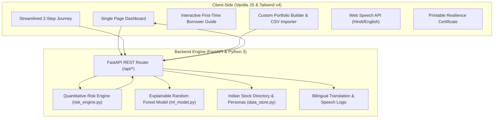

# 🛡️ LTV-Kavach (एलटीवी कवच)
### Public-Good Investor Resilience & Collateral Guardian for Loan Against Securities (LAS)
**Submission for SEBI • NSDL SANGYAN Investor Resilience Hackathon 2026**  
*Track: Financial Habits & Behavioural Resilience (Track D) & Investor Education for Bharat (Track C)*

[](https://www.python.org/)
[](https://fastapi.tiangolo.com/)
[](https://tailwindcss.com/)
[](#-regulatory-foundation--legal-rights)
[-amber.svg)](#-bharat-first-bilingual-parity)

---

## 📌 Executive Summary & Problem Statement

With the rapid digitization of Indian fintechs and digital NBFCs, obtaining a **Loan Against Securities (LAS)** or **Loan Against Mutual Funds (LAMF)** takes less than five minutes via instant Demat OTP lien marking. Millions of first-time retail investors across Tier-2, Tier-3, and rural Bharat now pledge their long-term wealth for short-term working capital or personal liquidity.

### The Hidden Collateral Trap:
1. **Denominator Shrinkage Shock**: 
   $$\text{LTV (Loan-to-Value)} = \left( \frac{\text{Fixed Loan Debt}}{\text{Pledged Collateral Market Value}} \right) \times 100$$
   When the stock market undergoes a standard correction, the borrower's debt stays fixed, but the collateral denominator shrinks—driving LTV steeply toward the lender's margin warning threshold (typically 65%) and liquidation cut-off (typically 75%).
2. **The Fragility of Smallcap Collateral**: First-time borrowers often pledge high-beta, volatile midcaps or smallcaps ($\beta > 1.8$). During broad market dips, these equities drop 2x to 3x faster than the Nifty 50, triggering sudden margin calls.
3. **Panic & Ineffective Recourse**: Upon receiving a terse SMS alert, retail borrowers panic. Unaware of their legal rights and the zero-cash recovery mechanisms available to them, borrowers frequently take high-interest payday loans or suffer forced liquidation at cyclical market bottoms.

---

## 🚀 The Solution: LTV-Kavach

**LTV-Kavach** is a public-good, calm-tech investor guardian. It provides retail borrowers with transparent risk diagnostics, legal empowerment, actionable de-risking options, and clear calm recovery steps before margin warnings ever strike.

```
┌────────────────────────────────────────────────────────────────────────┐
│                        LTV-KAVACH GUARDIAN ECOSYSTEM                   │
├────────────────────────────────────────────────────────────────────────┤
│  STEP 1: LOAN HEALTH & COLLATERAL SENSITIVITY                          │
│  • Segmented Multi-Color LTV Meter (Safe <50%, Warn 50-65%, Call >65%) │
│  • Buffer Before Bank Warning & Monthly Interest Cost Tracker          │
│  • Collateral Concentration (HHI Index) & High/Mod/Low Beta Exposure   │
│  • Actionable De-Risking Simulation: Swap Fragile Assets for Nifty 50  │
├────────────────────────────────────────────────────────────────────────┤
│  STEP 2: MARKET CRASH TEST & CALM RESTORATION                          │
│  • Interactive Market Shock Slider (-0% to -40%) with Presets         │
│  • Beta-Weighted Per-Stock Loss Breakdown (Asset-by-Asset Impact)      │
│  • Live Collateral vs Loan Debt Cushion Progress Visualizer            │
│  • 2-Step Calm Recovery Plan (Cash Prepayment vs Zero-Cash Demat OTP)  │
│  • Real-Time Monthly Interest Saved Calculation                        │
├────────────────────────────────────────────────────────────────────────┤
│  INVESTOR EDUCATION & UTILITIES                                        │
│  • First-Time Borrower Guide: 4 Interactive Educational Modules        │
│  • Contextual Quick Tooltips (? buttons) on Financial Concepts         │
│  • Printable 1-Page PDF "Portfolio Resilience Certificate"             │
│  • Depository SMS / WhatsApp Early-Warning Alert Simulator             │
│  • Live NSE/BSE Stock Search & Statement CSV Portfolio Importer        │
│  • 100% Bilingual Parity (Hindi ⇄ English) with Native Voice Readout   │
└────────────────────────────────────────────────────────────────────────┘
```

---

## ⚖️ Regulatory Foundation & Legal Rights

LTV-Kavach is designed around **SEBI and RBI regulatory frameworks**, educating retail borrowers on rights that lenders often obscure:

| Regulatory Feature | Regulatory Rule | Borrower Benefit |
| :--- | :--- | :--- |
| **Demat Custody & Ownership** | SEBI Margin Pledge Circulars | Pledged shares remain in the borrower's own Demat account under lien. Borrowers retain **100% of dividends, bonuses, and rights issues**. |
| **Mandatory Advance Notice** | RBI Prudential Norms for LAS | NBFCs and banks must provide advance cure windows (typically up to 7 working days) before taking any market action. |
| **No Silent Liquidation** | Depository Regulations (NSDL/CDSL) | Depositories send official SMS and email alerts directly to the investor's mobile number, preventing unilateral lender action. |
| **Right to Cure via Collateral** | RBI Master Direction | Borrowers are **never forced to pay cash**. Pledging unpledged bluechips or Debt Mutual Funds via instant OTP immediately restores the margin. |

---

## ✨ Key Capabilities & Innovations

### 1. Streamlined 2-Step Investor Journey
- **Step 1: Loan Health & Sensitivity Check**: Displays the LTV meter, exact distance to margin call in percent and rupees, estimated monthly interest burden at 10.5% p.a., and collateral volatility breakdown.
- **Step 2: Market Crash Simulator**: Allows users to simulate market dips (e.g., June 4 election dip -6%, correction -12%, panic crash -25%) and inspect how each individual asset holds up based on its individual beta.

### 2. Actionable De-Risking Simulation (Nifty 50 Swap)
- Identifies the highest-beta holding in the user's collateral basket (e.g., Suzlon $\beta = 2.15$).
- Allows the user to simulate replacing it with a Nifty 50 bluechip or liquid debt fund with a single click.
- Instantly visualizes the before-and-after drop cushion and portfolio beta reduction.

### 3. Calm 2-Step Margin Restoration Plan
When LTV enters the warning zone, the app shifts away from alarmist language to clear, calm steps:
- **Option 1 (Cash Paydown via UPI/IMPS)**: Exact rupee amount needed to restore the bulletproof 45% safe LTV, plus the resulting **monthly interest saved**.
- **Option 2 (Zero-Cash Demat OTP Pledge)**: Exact number of Reliance/TCS shares or Debt MF units needed to restore safe LTV via instant NSDL OTP—requiring zero cash.

### 4. First-Time Borrower Guide Modal & Quick Tooltips
- **4 Educational Modules**:
  1. *LTV Formula Mechanics*: Why the ratio spikes as prices fall even though the loan balance is unchanged.
  2. *Your Legal Rights*: SEBI demat custody rules, mandatory cure notices, and dividend entitlement.
  3. *Beta & Volatility 101*: Why smallcaps swing 2x harder than Nifty 50.
  4. *Zero-Cash Rescue Playbook*: 4-step walkthrough for pledging spare units via NSDL OTP.
- **Micro-Tooltips**: `?` buttons next to complex financial metrics (LTV, Buffer, Beta, HHI, Haircuts, Monthly Interest, Zero-Cash Pledge).

### 5. Printable Portfolio Resilience Certificate
- Generates a 1-page, clean PDF summary via `window.print()` and custom `@media print` styling.
- Strips away interactive sliders and sidebars to produce a formal certificate showing portfolio health, collateral valuation, and regulatory compliance.

### 6. Live NSE Stock Integration & CSV Importer
- Autocomplete search querying active Indian equities (Reliance, TCS, HDFC Bank, Infosys, Suzlon, Zomato, etc.) with real-time valuations.
- Paste broker CSV statement rows (`SYMBOL, UNITS`) for instant parsing and risk modeling.

### 7. Bharat-First Bilingual Parity
- 100% dictionary parity between English and Hindi across all 152 interface elements, tooltips, guide texts, and error prompts.
- Native speech synthesis (`SpeechSynthesisUtterance`) providing clear spoken vernacular audio advice.

---

## 🏛️ System Architecture



---

## 📊 Quantitative Models & Real-World Formulas

### 1. Effective Debt & Unserviced Interest Creep
In Indian LAS overdraft facilities, interest is computed daily at benchmark rate $r = 10.5\% \text{ p.a.}$ Unpaid interest adds directly to the debt:
$$D_{\text{effective}} = D_{\text{principal}} + \text{round}\left( \frac{D_{\text{principal}} \times r \times t_{\text{days}}}{365} \right)$$

### 2. Dual Regulatory LTV Formulation
- **Gross Market LTV (RBI Benchmark Ratio)**:
  $$\text{LTV}_{\text{gross}} = \left( \frac{D_{\text{effective}}}{\sum_{i=1}^n V_i} \right) \times 100$$
  *Governs RBI prudential limits: $\le 50\%$ (Safe/Cap), $50\% - 65\%$ (Statutory Cure Notice), $\ge 75\%$ (Liquidation).*

- **Post-Haircut Drawing Power & Effective LTV**:
  $$\text{Drawing Power} = \sum_{i=1}^n V_i \times (1 - H_i)$$
  $$\text{LTV}_{\text{effective}} = \left( \frac{D_{\text{effective}}}{\text{Drawing Power}} \right) \times 100$$
  *Where $H_i$ represents the regulatory haircut ($10\% - 15\%$ for Debt MFs, $20\% - 30\%$ for Nifty 50 Bluechips, $40\% - 50\%$ for Smallcaps).*

### 3. Market Drop Distance to Warning Buffer
$$\text{Drop Required to hit } \text{LTV}_{\text{warn}} = 1 - \frac{D_{\text{effective}}}{\text{Total Collateral} \times \text{LTV}_{\text{warn}}}$$
$$\text{Market Drop Cushion} = \frac{\text{Drop Required}}{\beta_p}$$

### 4. RBI 50% Shortfall & Calm Remedies
- **RBI 50% Shortfall**:
  $$\text{Shortfall}_{\text{RBI}} = \max\left(0, \; D_{\text{effective}} - (0.50 \times \text{Collateral})\right)$$
- **Monthly Interest Savings via Cash Paydown**:
  $$\Delta I_{\text{monthly}} = \frac{\text{Cash Paydown} \times 10.5\%}{12}$$
- **Zero-Cash Collateral Top-Up**:
  $$\text{Collateral Top-up} = \max\left(0, \; \frac{D_{\text{effective}}}{0.45} - \text{Collateral}\right)$$

### 5. Concentration Index (HHI)
$$\text{HHI} = \sum_{i=1}^n (w_i \times 100)^2$$
*(HHI > 2,500 indicates dangerous single-stock concentration).*

---

## 🚀 Quickstart & Verification

### Prerequisites
- Python 3.10+
- Modern Web Browser (Chrome, Firefox, Safari, Edge)

### 1. Clone & Start the Server
```bash
git clone https://github.com/your-org/ltv-kavach.git
cd ltv-kavach
./run.sh
```
*The FastAPI backend will start on `http://localhost:8000`.*

### 2. Access the Application
- **Interactive Web App**: [http://localhost:8000](http://localhost:8000)
- **Interactive API Swagger Docs**: [http://localhost:8000/docs](http://localhost:8000/docs)

### 3. Run Automated Unit Tests
```bash
python3 tests/test_risk_engine.py
```
*Verifies portfolio metrics, sensitivity, de-risking swaps, calm remedies, and stress-test normalization across 8 comprehensive test cases.*

---

## 🎬 3-Minute Hackathon Demonstration Script

| Time | Segment | On-Screen Action | Key Talking Points |
| :---: | :--- | :--- | :--- |
| **0:00 - 0:40** | **The Crisis in Bharat** | Open Dashboard on Ramesh Gupta | "Millions in Tier-2/3 cities pledge shares for quick loans. A routine market dip spikes their LTV from 64% into margin call territory." |
| **0:40 - 1:20** | **Loan Health & De-risking** | Show Step 1 Health Meter & De-risking Swap | "Rather than panic, LTV-Kavach calculates that Ramesh's collateral is 100% volatile smallcaps. Swapping Suzlon for a Nifty 50 bluechip drops beta by 27.4%." |
| **1:20 - 2:00** | **Crash Test & Calm Mitigation** | Move slider to -20% | "Notice our calm recovery plan: Pay ₹2.14L cash (saving ₹1,878/month in interest) OR pledge 409 shares of Reliance via instant Demat OTP with ₹0 cash." |
| **2:00 - 2:30** | **Investor Guide & Rights** | Click 'Investor Guide' button | "We educate borrowers on their SEBI rights: shares stay in your demat, you keep 100% dividends, and banks must give advance cure notices." |
| **2:30 - 3:00** | **Printable Certificate & Conclusion** | Click 'Print / PDF' | "One-click resilience certificate for borrowers, 100% Hindi/English parity, zero commercial upsells. Pure public-good investor protection." |

---

## 📜 License
Distributed under the **MIT Open Source License** for public good financial literacy and investor protection. Built for **SEBI • NSDL SANGYAN 2026**.
